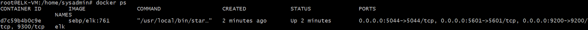

# Cybersecurity Project 1

## Automated ELK Stack Deployment

The files in this repository were used to configure the network depicted below.

Diagrams/elk-stack-diagram.png

These files have been tested and used to generate a live ELK deployment on Azure. They can be used to re-create the entire deployment pictured above. Alternatively, select portions of the playbooks (or .yml files) may be used to install only certain pieces of it, such as Filebeat.

- TODO: Insert Playbooks

This document contains the following details:
- Description of the Topology
- Access Policies
- ELK Configuration
  - Beats in Use
  - Machines Being Monitored
- How to Use the Ansible Build

### Description of the Topology

The main purpose of this network is to expose a load-balanced and monitored instance of DVWA, the Damn Vulnerable Web Application.

Load balancing between 3 identical servers ensures that the application will be highly available, in addition to restricting access to the network (including an excess of traffic, as would be seen during a DNS attack). 

Using a Jumpbox virtual machine (VM) to provision the 3 DVWA servers simplifies and streamlines their deployment and makes the process more secure. It facilitates maintenance, configuration modifications and updates, and even scalability should the need to expand arise in the future. It essentially automates the entire process. 
- _TODO: What aspect of security do load balancers protect? What is the advantage of a jump box?_

Integrating an ELK server allows system administrators to easily monitor the vulnerable VMs for changes to the event logs, system files and system metrics. Filebeat watches for changes to the file system, including which files have changed and when. Metricbeat helps monitor servers by collecting machine metrics such as CPU usage or uptime to monitor overall system health. 

The configuration details of each machine may be found below.

| Name     | Function    | IP Address |   Operating System   | Azure VM Size | vCPUs | RAM (GB) |
|----------|-------------|------------|----------------------|---------------|-------|----------|
| Jumpbox  | Gateway     | 10.0.0.5   | Linux (ubuntu 18.04) | B1s           |   1   |    1     |
| Web1     | DVWA Server | 10.0.0.8   | Linux (ubuntu 18.04) | B1ms          |   1   |    2     |
| Web2     | DVWA Server | 10.0.0.9   | Linux (ubuntu 18.04) | B1ms          |   1   |    2     |
| Web3     | DVWA Server | 10.0.0.10  | Linux (ubuntu 18.04) | B1ms          |   1   |    2     |
| ELK-VM   | Log Server  | 10.1.0.4   | Linux (ubuntu 18.04) | D2s v3        |   2   |    8     | 

### Access Policies

Only the Jumpbox provisioning machine can accept connections directly from the Internet. Access to this machine may be granted as needed during deployment, configuration and maintenance, and is only allowed from a single, confidential, previously whitelisted IP address, known only to the administrator.

The machines on the internal network are not directly exposed to the public Internet. The 3 DVWA Servers can be accessed by http traffic from the internet through the Azure Load Balancer. They can accept SSH traffic from the Jumpbox which is in the same virtual network. They can transmit data to the ELK Server which is located in a separate virtual network, which has a peer-to-peer relationship with their own virtual network. 

The ELK Server VM can be accessed from the Jumpbox Provisioner, and can receive data from the DVWA Servers over its own virtual network which has a peer-to-peer relationship with the DVWA Servers' virtual network. The Elk Server can also communicate with the administrator's machine over 3 previously designated ports. 

A summary of the access policies in place can be found in the table below.

| Name          | Publicly Accessible?   | Allowed IP Addresses         |
|---------------|------------------------|------------------------------|
| Jump Box      | Limited                | Confidential, whitelisted IP |
| Load Balancer | Yes                    | Any                          |
| Web1          | only via Load Balancer | 10.0.0.5                     |
| Web2          | only via Load Balancer | 10.0.0.5                     |                     
| Web3          | only via Load Balancer | 10.0.0.5                     |
| ELK-VM        | Limited                | Confidential, whitelisted IP |

### Elk Configuration

Ansible was used to automate configuration of the ELK machine. No configuration was performed manually, which is advantageous because...
- _TODO: What is the main advantage of automating configuration with Ansible?_

The playbook implements the following tasks:
- _TODO: In 3-5 bullets, explain the steps of the ELK installation play. E.g., install Docker; download image; etc._
- ...
- ...

The following screenshot displays the result of running `docker ps` after successfully configuring the ELK instance.

**Note**: The following image link needs to be updated. Replace `docker_ps_output.png` with the name of your screenshot image file.  

### Target Machines & Beats
This ELK server is configured to monitor the following machines:
- _TODO: List the IP addresses of the machines you are monitoring_

We have installed the following Beats on these machines:
- _TODO: Specify which Beats you successfully installed_

These Beats allow us to collect the following information from each machine:
- _TODO: In 1-2 sentences, explain what kind of data each beat collects, and provide 1 example of what you expect to see. E.g., `Winlogbeat` collects Windows logs, which we use to track user logon events, etc._

### Using the Playbook
In order to use the playbook, you will need to have an Ansible control node already configured. Assuming you have such a control node provisioned: 

SSH into the control node and follow the steps below:
- Copy the _____ file to _____.
- Update the _____ file to include...
- Run the playbook, and navigate to ____ to check that the installation worked as expected.

_TODO: Answer the following questions to fill in the blanks:_
- _Which file is the playbook? Where do you copy it?_
- _Which file do you update to make Ansible run the playbook on a specific machine? How do I specify which machine to install the ELK server on versus which to install Filebeat on?_
- _Which URL do you navigate to in order to check that the ELK server is running?

_As a **Bonus**, provide the specific commands the user will need to run to download the playbook, update the files, etc._
