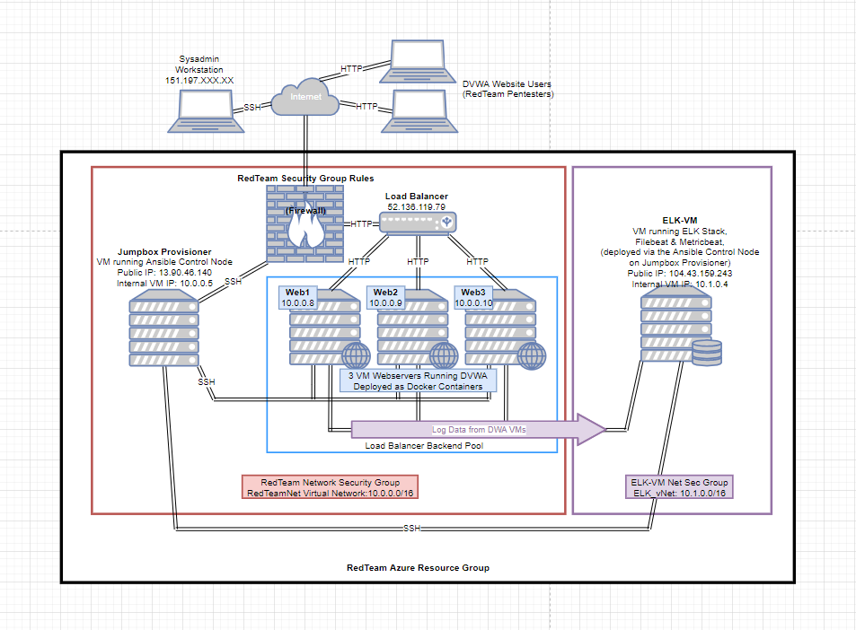

# Cybersecurity Project 1

## Automated ELK Stack Deployment

The files in this repository were used to configure the network depicted below.

These files have been tested and used to generate a live ELK deployment on Azure. They can be used to re-create the entire deployment pictured above. Alternatively, select portions of the playbooks (or .yml files) may be used to install only certain pieces of it, such as Filebeat.

- [DVWA Deployment Playbook][Ansible/dvwa-playbook.yml]
- [ELK Deployment Playbook][Ansible/install-elk.yml]
- [Filebeat Deployment Playbook][Ansible/filebeat-playbook.yml]
- [Metricbeat Deployment Playbook][Ansible/metricbeat-playbook.yml]

This document contains the following details:
- Description of the Topology
- Access Policies
- ELK Configuration
  - Beats in Use
  - Machines Being Monitored
- How to Use the Ansible Build

### Description of the Topology

The main purpose of this network is to expose a load-balanced and monitored instance of DVWA, the Damn Vulnerable Web Application.

Hosting DVWA on 3 separate virtual machines and load balancing between the 3 servers ensures that the application will be highly available. Availability is an essential component of the CIA triad. Multiple machines provides redundancy and resilience. The load balancer not only apportions traffic to share the load, but also restricts external access to the network, including an excess of traffic, as would be seen during a DoS attack. 

Using a Jumpbox virtual machine (VM) to provision the 3 DVWA servers automates and streamlines their deployment and makes the process more secure by restricting administrative access to a single machine.  Using a provisioner to deploy infrastructure as code provides the additional benefits of drastically reducing the potential for human error, and making it easy to configure and deploy numerous instances of an identical machine simultaneously. Furthermore, in the event one of the servers is compromised, it can be easily removed and a fresh instance deployed. 

Integrating an ELK server allows system administrators to easily monitor the vulnerable VMs for changes to their event logs, system files and system metrics. Filebeat helps generate and organize log files to send to Logstash and Elasticsearch. It watches for changes to the file system, logging which files have changed and when. Metricbeat helps monitor servers by collecting machine metrics (such as CPU usage or uptime) to monitor overall system health and performance. 

The configuration details of each machine may be found below.

| Name     | Function            | IP Address |   Operating System   | Azure VM Size | vCPUs | RAM (GB) |
|----------|---------------------|------------|----------------------|---------------|-------|----------|
| Jumpbox  | Gateway/Provisioner | 10.0.0.5   | Linux (ubuntu 18.04) | B1s           |   1   |    1     |
| Web1     | DVWA Server         | 10.0.0.8   | Linux (ubuntu 18.04) | B1ms          |   1   |    2     |
| Web2     | DVWA Server         | 10.0.0.9   | Linux (ubuntu 18.04) | B1ms          |   1   |    2     |
| Web3     | DVWA Server         | 10.0.0.10  | Linux (ubuntu 18.04) | B1ms          |   1   |    2     |
| ELK-VM   | Log Server          | 10.1.0.4   | Linux (ubuntu 18.04) | D2s v3        |   2   |    8     | 

### Access Policies

The Jumpbox provisioning machine (10.0.0.5) can accept connections directly from the public internet. Access to this machine may be granted as needed during deployment, configuration and maintenance, and is only permitted from a single, confidential, previously whitelisted IP address, which is known only to the administrator. For additional security, authentication requires posession of a private SSH key.  

The DVWA Servers on the internal network are not directly exposed to the public internet. These 3 machines (10.0.0.8, 10.0.0.9, & 10.0.0.10) can be accessed by http traffic from the internet through the Azure Load Balancer. They can accept SSH traffic from the Jumpbox which is placed in the same virtual network. They can transmit data to the ELK Server VM located in a separate virtual network, which has a peer-to-peer relationship with their own virtual network. 

The ELK-VM Server (10.1.0.4) can be accessed from the administrator's machine, or via the Jumpbox provisioner, and can receive data from the DVWA Servers over its own virtual network which has a peer-to-peer relationship with the DVWA Servers' virtual network. 

A summary of the access policies in place can be found in the table below.

| Name          | Publicly Accessible?    | Allowed IP Addresses         |
|---------------|-------------------------|------------------------------|
| Jump Box      | Limited                 | Confidential, whitelisted IP |
| Load Balancer | Yes                     | Any                          |
| Web1          | only via Load Balancer  | 10.0.0.5 via SSH             |
| Web2          | only via Load Balancer  | 10.0.0.5 via SSH             |                     
| Web3          | only via Load Balancer  | 10.0.0.5 via SSH             |
| ELK-VM        | Limited - certain ports | Confidential, whitelisted IP |
|               |                         | and 10.0.0.5                 |

### Elk Configuration

Ansible was used to automate configuration of the ELK machine. No configuration was performed manually, which is advantageous because it greatly simplifies installation, reduces the potential for human error, and is easily reproducible. Ansible as a provisioning tool will ensure our provisioning scripts run identically everywhere and do exactly the same thing every time they run.

The playbook implements the following tasks:
- Installs the Docker engine, Python software, and Python Client for Docker.
- Increases virtual memory and tells the system to use more memory
- Downloads a Docker container image of ELK (sebp/elk:761)
- Starts the ELK container
- Configures port mappings which ELK will use to communicate

The following screenshot displays the result of running `docker ps` after successfully configuring the ELK instance.

### Target Machines & Beats

This ELK server is configured to monitor the following machines:
  -  Web1: 10.0.0.8
  -  Web2: 10.0.0.9
  -  Web3: 10.0.0.10

We have installed the following Beats on these machines:
  - Filebeat
  - Metricbeat

These Beats allow us to collect the following information from each machine:
- Filebeat collects data about the system files. It keeps track of which files changed and when and forwards that information along for indexing, parsing, and analysis. 
- Metricbeat collects machine metrics such as CPU usage or uptime, which we use to monitor system health or resource availability. 

### Using the Playbook
In order to use the playbook, you will need to have an Ansible control node already configured. Assuming you have such a control node provisioned: 

SSH into the control node and follow the steps below:
- Copy the Filebeat Configuration file (filebeat-config.yml) to the control node.
- Update the Filebeat Configuration file hosts entries for Elasticsearch and Kibana to include the ELK VM's IP address (10.1.0.4). See lines 1106 and 1806. 
- Save the updated file in /etc/ansible/files/filebeat-configuration.yml on the control node.
- Create a new playbook (filebeat-playbook.yml) in the /etc/ansible/roles/ directory that will install, drop in the updated configuration file, enable and configure system module, run the filebeat setup and start the filebeat service. 
- Run the filebeat playbook (filebeat-playbook.yml), and navigate to the ELK server to check that the installation worked as expected.

_TODO: Answer the following questions to fill in the blanks:_
- _Which file is the playbook? Where do you copy it?_ copy install-elk.yml, filebeat-playbook.yml, and metricbeat-playbook.yml to the directory /etc/ansible/roles/     

- _Which file do you update to make Ansible run a playbook on a specific machine? How do I specify which machine to install the ELK server on versus which to install Filebeat on?_ ? The files you needed to update were the filebeat-config.yml and metricbeat-config.yml files, which are configuration files that will be dropped into the Elk Server when the install-elk ansible playbook runs. You also update the host.cfg file in the /etc/ansible directory, which already specified the group of 3 DVWA Web Server hosts, you create a new group called Elk Servers and add the IP of the Elk Server (10.1.0.4) to that group. When updating the filebeat-config.yml and metricbeat-config.yml file you need to designate the Private IP of the Elk-Server on two lines of the .yml files. See lines 1106 and 1806.

- _Which URL do you navigate to in order to check that the ELK server is running? [ELK-VM public IP]:5601

_As a **Bonus**, provide the specific commands the user will need to run to download the playbook, update the files, etc._

The commands needed to run the Ansible configuration for the Elk-Server are:

- ssh -i ~/Downloads/Jumpbox-Provisioner_key1.pem redadmin@52.249.190.79
- sudo docker container list -a (locate your ansible container)
- sudo docker start container (name of the container - e.g., unruffled tu)
- sudo docker attach container (name of the container - e.g., unruffled tu)
- cd /etc/ansible/
- ansible-playbook install-elk.yml (configures Elk VM and starts the Elk container on the Elk VM)
- cd /etc/ansible/roles/
- ansible-playbook filebeat-playbook.yml (installs Filebeat)
- ansible-playbook metricbeat-playbook.yml (installs Metricbeat)
- open a new web browser @ IP address [Elk-Server PublicIP]:5601 (This will bring up the Kibana Web Portal)

